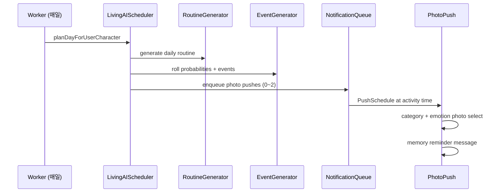

# Living AI — 살아있는 여자친구 시스템

> "이 AI가 살아있는 것 같다."

사용자가 먼저 말을 거는 챗봇이 아니라, **AI가 하루를 살아가며 먼저 연락하는** 구조입니다.

---

## 아키텍처

```
┌─────────────────────┐     ┌──────────────────────────┐
│ DailyRoutineGenerator│────▶│ CharacterDailyRoutine DB │
└─────────┬───────────┘     └──────────────────────────┘
          │
          ▼
┌─────────────────────┐     ┌──────────────────────────┐
│ RandomEventGenerator │────▶│ DailyLifeEvent DB        │
└─────────┬───────────┘     └──────────────────────────┘
          │
          ▼
┌─────────────────────┐     ┌──────────────────────────┐
│ LivingAIScheduler    │────▶│ NotificationQueue        │
└─────────┬───────────┘     └──────────┬───────────────┘
          │                              │
          ▼                              ▼
┌─────────────────────┐     ┌──────────────────────────┐
│ EmotionStateManager  │     │ PushSchedule → Photo Push│
│ MemoryReminderEngine │     │ PhotoPushSelector        │
│ RelationshipEngine   │     └──────────────────────────┘
└─────────────────────┘
```

---

## 신규 모듈

| 모듈 | 경로 | 역할 |
|------|------|------|
| `LivingAIScheduler` | `src/lib/living-ai/living-ai-scheduler.ts` | 일일 계획 오케스트레이션 |
| `DailyRoutineGenerator` | `daily-routine-generator.ts` | ±30~90분 랜덤 일과 |
| `DailyLifeGenerator` | `daily-life-generator.ts` | 하루 일상 DB 저장 |
| `RandomEventGenerator` | `random-event-generator.ts` | 확률 기반 이벤트 |
| `EmotionStateManager` | `emotion-state-manager.ts` | 감정 유지·변화 |
| `RelationshipEventEngine` | `relationship-event-engine.ts` | 호감도 행동 변화 |
| `MemoryReminderEngine` | `memory-reminder-engine.ts` | 단기/장기 기억 |
| `PhotoPushSelector` | `photo-push-selector.ts` | 상황+감정 사진 선택 |
| `NotificationQueue` | `notification-queue.ts` | 알림 큐 |
| `MessageVariation` | `message-variation.ts` | 자연스러운 말투 |

설정: `src/config/living-ai.config.ts`

---

## 이벤트 흐름



---

## 푸시 스케줄 로직

1. **확률 roll** — `contactToday` 65%, `photoToday` 45% 등 (매일 seed 기반)
2. **요일 가중치** — 화/토 연락 적음, 일/목 많음
3. **호감도 보정** — 높을수록 먼저 연락 확률 ↑
4. **발송 횟수** — 0~2회, 금요일·화요일 추가 랜덤 0회
5. **시간** — 일과 활동 시각 또는 랜덤 윈도우
6. **Skip Day** — 기존 로직 유지

---

## 감정 변화 로직

| 트리거 | 감정 변화 |
|--------|-----------|
| 긍정 답장 | HAPPY → LOVE |
| 부정 답장 | SAD |
| 밤 시간 (22~07) | SLEEPY |
| 비 | LOVE (40%) |
| 이벤트 | 이벤트별 기본 감정 |
| 4시간+ 경과 | 강도 감쇠, 부정 감정 완화 |

---

## 기억 시스템

### 단기 (24시간)
- 키워드: 감기, 시험, 야근, 비, 늦잠 등
- 다음 푸시에서 먼저 언급: "감기 좀 괜찮아?"

### 장기
- 좋아해/싫어/생일/직업 패턴 추출
- 메시지에 자연스럽게 삽입

---

## API

| Method | Endpoint | 설명 |
|--------|----------|------|
| GET | `/api/living/routine/:userCharacterId` | 오늘 일과 |
| GET | `/api/living/emotion/:userCharacterId` | 현재 감정 |
| GET | `/api/living/relationship/:userCharacterId` | 호감도 + 기억 |
| GET | `/api/living/events/:userCharacterId` | 오늘 이벤트 |
| POST | `/api/living/plan/:userId` | 수동 일일 계획 |

---

## 향후 확장

- LLM 기반 대화 생성 (현재는 템플릿 + variation)
- 날씨 API 연동
- 멀티 캐릭터 동시 일과
- BullMQ NotificationQueue
- 벡터 장기 기억 (RAG)
