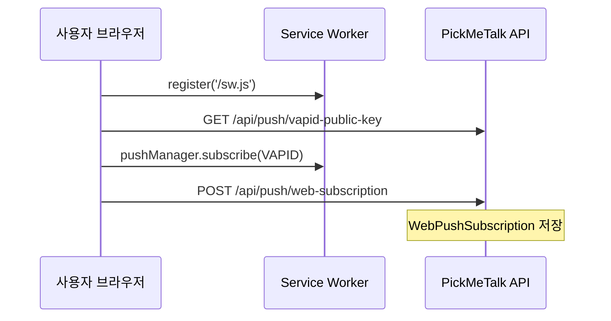

# PickMeTalk 사진 푸시 시스템

> "와… 진짜 사람이 나를 기다려주는 것 같다."

AI 연인이 실제 사람처럼 자연스러운 사진과 메시지를 보내는 푸시 알림 시스템 설계·운영 문서입니다.

---

## 목차

1. [아키텍처 개요](#1-아키텍처-개요)
2. [발송 규칙](#2-발송-규칙)
3. [Web Push](#3-web-push)
4. [네이티브 푸시 (FCM)](#4-네이티브-푸시-fcm)
5. [사진 에셋 파이프라인](#5-사진-에셋-파이프라인)
6. [후속 반응 시나리오](#6-후속-반응-시나리오)
7. [API 레퍼런스](#7-api-레퍼런스)
8. [환경 변수](#8-환경-변수)
9. [운영 Runbook](#9-운영-runbook)
10. [구현 체크리스트](#10-구현-체크리스트)

---

## 1. 아키텍처 개요

```
┌─────────────────┐     ┌──────────────────┐     ┌─────────────────┐
│  스케줄러 워커   │────▶│  Photo Selector  │────▶│  CharacterPhoto │
│  (5분 주기)     │     │  + Message       │     │  DB (CDN URL)   │
└────────┬────────┘     └──────────────────┘     └─────────────────┘
         │
         ▼
┌─────────────────┐     ┌──────────────────┐
│ PushNotification│────▶│ FCM (iOS/Android)│
│    Service      │     │ Web Push (브라우저)│
└────────┬────────┘     └──────────────────┘
         │
         ▼
┌─────────────────┐     ┌──────────────────┐
│   PushLog       │────▶│ FollowUp Engine  │
│   Analytics     │     │ (30분/2시간/익일) │
└─────────────────┘     └──────────────────┘
```

### 핵심 설계 원칙

| 원칙 | 설명 |
|------|------|
| 감정 설계 우선 | 기능이 아닌 "기다리는 사람" 느낌 |
| 광고 푸시 금지 | 타이틀 없이 메시지만, 사진 도착 느낌 |
| 랜덤성 | 매일 다른 시간·패턴 |
| 개인화 | 사용자 이름 자연스럽게 삽입 |
| 중복 방지 | 사진 90일, 멘트 30일 쿨다운 |

### 프로젝트 구조

```
src/
├── config/push.config.ts          # 발송 상수
├── data/photo-message-templates.ts # 상황별 메시지
├── services/
│   ├── scheduler.service.ts       # 일정 생성·실행
│   ├── photo-selector.service.ts  # 사진/메시지 선택
│   ├── engagement.service.ts      # 참여도 기반 빈도
│   ├── followup.service.ts        # 후속 반응
│   ├── push-notification.service.ts
│   └── web-push.service.ts        # Web Push 전용
├── routes/push.routes.ts
├── workers/push-scheduler.worker.ts
scripts/
├── import-local-photos.ts         # 로컬 이미지 일괄 등록
└── generate-vapid-keys.ts         # VAPID 키 생성
public/
├── sw.js                          # Service Worker
└── push-client.js                 # 구독 헬퍼
assets/photos/                     # 로컬/CDN 사진 저장
docs/PHOTO_PUSH.md                 # 이 문서
```

---

## 2. 발송 규칙

### 기본 빈도

| 항목 | 값 |
|------|-----|
| 하루 기본 | 0~2회 |
| 절대 상한 | 2회 (특별한 날 보너스 제외) |
| 특별한 날 보너스 | +1회 (생일, 기념일, 100일) |
| Skip Day | 월 1~2회 일부러 미발송 |
| 참여도 배율 | 0.5x ~ 1.5x |

### 랜덤 발송 시간대

| 윈도우 | 시간 |
|--------|------|
| 아침 | 08:00 ~ 10:00 |
| 점심 전후 | 11:00 ~ 13:00 |
| 오후 | 14:00 ~ 16:00 |
| 저녁 | 18:00 ~ 20:00 |
| 밤 | 21:00 ~ 22:00 |

같은 시간·같은 요일 패턴 반복 금지. timezone은 사용자별 `Asia/Seoul` 등 적용.

### 상황별 카테고리 (요일 가중치)

| 요일 | 추천 상황 |
|------|-----------|
| 월 | 출근 응원, 아침 셀카, 커피 |
| 화 | 퇴근, 떡볶이 |
| 수 | 운동, 커피, 거울 셀카 |
| 목 | 셀카, 미용실 |
| 금 | 퇴근, 술, 게임 (미발송 확률 ↑) |
| 토 | 놀러, 쇼핑, 영화 |
| 일 | 브런치, 집에서 쉬기, 산책 |

---

## 3. Web Push

브라우저(PWA/웹) 사용자를 위한 VAPID 기반 Web Push입니다.

### 3.1 VAPID 키 생성

```bash
npx tsx scripts/generate-vapid-keys.ts
```

출력된 키를 `.env`에 설정:

```env
VAPID_PUBLIC_KEY=BNx...
VAPID_PRIVATE_KEY=abc...
VAPID_SUBJECT=mailto:support@pickmetalk.com
```

### 3.2 클라이언트 구독 플로우



### 3.3 Service Worker (`public/sw.js`)

- `push` 이벤트: 사진 미리보기 + 메시지 표시
- `notificationclick`: `deepLink`로 채팅 화면 이동
- 클릭 시 `POST /api/push/click/:pushLogId` 호출

### 3.4 구독 API

**등록**

```http
POST /api/push/web-subscription
Content-Type: application/json

{
  "userId": "uuid",
  "subscription": {
    "endpoint": "https://fcm.googleapis.com/fcm/send/...",
    "keys": {
      "p256dh": "...",
      "auth": "..."
    }
  }
}
```

**해제**

```http
DELETE /api/push/web-subscription
Content-Type: application/json

{ "endpoint": "https://..." }
```

**VAPID 공개키**

```http
GET /api/push/vapid-public-key
→ { "publicKey": "BNx..." }
```

### 3.5 Web Push Payload

```json
{
  "title": "",
  "body": "오늘 머리했는데 어때? 😊",
  "image": "https://cdn.pickmetalk.com/photos/.../thumb.jpg",
  "data": {
    "type": "photo_push",
    "pushLogId": "uuid",
    "characterId": "uuid",
    "photoUrl": "https://...",
    "message": "오늘 머리했는데 어때? 😊",
    "deepLink": "/chat/uuid?pushLogId=uuid"
  }
}
```

### 3.6 만료 구독 처리

- HTTP 410 Gone 수신 시 해당 `endpoint` 자동 삭제
- 재구독 UX: 앱 재방문 시 `push-client.js`의 `ensureSubscribed()` 호출

### 3.7 브라우저 지원

| 브라우저 | Rich Image | 비고 |
|----------|------------|------|
| Chrome | ✅ | `image` 필드 |
| Firefox | ✅ | `image` 필드 |
| Safari 16.4+ | ⚠️ | macOS/iOS PWA 제한적 |
| Edge | ✅ | Chromium 기반 |

---

## 4. 네이티브 푸시 (FCM)

### 디바이스 토큰 등록

```http
POST /api/push/device-token
{
  "userId": "uuid",
  "token": "fcm-token",
  "platform": "IOS" | "ANDROID"
}
```

### Firebase 설정

1. Firebase Console → 프로젝트 생성
2. 서비스 계정 JSON → `.env`의 `FIREBASE_*` 변수
3. Android: `photo_push` notification channel
4. iOS: `mutable-content` + Notification Service Extension (이미지 rich push)

---

## 5. 사진 에셋 파이프라인

### 5.1 목표

- 캐릭터당 **약 1,000장** 고품질 자연스러운 사진
- 실제 휴대폰 셀카 느낌 (AI 티 최소화)
- 표정·배경·조명·구도·의상·계절·날씨·시간대 다양화

### 5.2 참고 이미지 (로컬 예시)

Windows 로컬 경로 예시:

```
C:\Users\user\OneDrive\Desktop\픽미톡 ai\
```

클라우드 환경에서는 직접 접근 불가. 아래 방법으로 등록:

**방법 A: import 스크립트 (로컬 PC에서 실행)**

```bash
# 폴더 구조 예시
# 픽미톡 ai/
#   수아/
#     아침_셀카_01.jpg
#     커피_02.jpg
#     머리_03.jpg

LOCAL_PHOTOS_DIR="C:/Users/user/OneDrive/Desktop/픽미톡 ai" \
CHARACTER_ID="00000000-0000-0000-0000-000000000001" \
npx tsx scripts/import-local-photos.ts
```

파일명 규칙: `{카테고리키워드}_{번호}.jpg`

| 키워드 | PhotoCategory |
|--------|---------------|
| 아침, 침대, 기상 | SELFIE_BED |
| 커피, 카페 | COFFEE_CAFE |
| 야근, 책상 | WORK_OVERTIME |
| 퇴근 | WORK_LEAVE |
| 머리, 미용실 | HAIR_SALON |
| 네일 | NAIL_ART |
| 술 | DRINKING |
| 떡볶이 | FOOD_TTEOKBOKKI |
| 운동, 헬스 | EXERCISE_GYM |
| 주말, 놀러 | WEEKEND_OUT |
| 셀카 | SELFIE_GENERAL |

**방법 B: CDN URL 직접 등록**

`prisma/seed.ts` 또는 Admin API로 `CharacterPhoto` 레코드 생성.

### 5.3 파이프라인 단계

```
[참고 이미지/프롬프트] → [생성/촬영] → [품질 검수] → [썸네일] → [CDN 업로드] → [DB 등록]
```

| 단계 | 도구 | 기준 |
|------|------|------|
| 품질 검수 | 수동 + AI 스코어 | AI 티, 손가락 왜곡, NSFW |
| 중복 감지 | contentHash (pHash) | 유사도 90% 이상 거부 |
| 썸네일 | 400px WebP | 푸시 미리보기용 |
| 인벤토리 | Admin API | 카테고리별 최소 20장 |

### 5.4 CharacterPhoto 스키마

```prisma
model CharacterPhoto {
  id           String
  characterId  String
  url          String        // 원본 CDN URL
  thumbnailUrl String?       // 푸시용 썸네일
  category     PhotoCategory
  tags         String[]
  expression   String?       // 기쁨, 졸림, 슬픔...
  background   String?       // 침대, 카페, 거리...
  lighting     String?
  cameraAngle  String?
  timeOfDay    TimeOfDay?
  season       Season?
  weather      Weather?
  contentHash  String?       // 중복 감지
  status       PhotoStatus   // PENDING_REVIEW | ACTIVE | REJECTED
}
```

### 5.5 인벤토리 최소 기준

| 구분 | 최소 장수 |
|------|-----------|
| 카테고리당 | 20장 |
| 캐릭터당 (운영 가능) | 300장 |
| 캐릭터당 (목표) | 1,000장 |

인벤토리 부족 시 `photo-selector.service`가 fallback 후 없으면 푸시 `CANCELLED`.

### 5.6 샘플 에셋 (`assets/photos/`)

레포에 포함된 샘플 이미지는 개발/데모용입니다. 프로덕션은 CDN으로 서빙.

---

## 6. 후속 반응 시나리오

### 머리 사진 예시

```
📸 "오늘 머리했는데 어때? 😊"
   ↓ 30분 답장 없음
💬 "바쁜가 봐 😊 나중에 봐도 돼!"
   ↓ 2시간 답장 없음
💬 "별론가… 😥"
   ↓ 답장: "예뻐"
💬 "😀❤️"
```

### 트리거 조건

| condition | 설명 |
|-----------|------|
| `no_reply` | 답장 없음 (30분, 2시간, 익일) |
| `positive_reply` | 긍정 키워드 (예뻐, 좋아, ❤️) |
| `negative_reply` | 부정 키워드 (별로, 안 예뻐) |
| `late_reply` | 2시간 이상 지연 답장 |

---

## 7. API 레퍼런스

### 사용자

| Method | Endpoint | 설명 |
|--------|----------|------|
| POST | `/api/users` | 사용자 생성 |
| GET | `/api/users/:userId` | 조회 |
| POST | `/api/users/:userId/characters` | 캐릭터 연결 |
| POST | `/api/users/:userId/special-days` | 특별한 날 |

### 푸시

| Method | Endpoint | 설명 |
|--------|----------|------|
| GET | `/api/push/vapid-public-key` | Web Push VAPID 공개키 |
| POST | `/api/push/web-subscription` | Web Push 구독 |
| DELETE | `/api/push/web-subscription` | 구독 해제 |
| POST | `/api/push/device-token` | FCM 토큰 |
| POST | `/api/push/click/:pushLogId` | 클릭 기록 |
| POST | `/api/push/view/:pushLogId` | 사진 열람 |
| POST | `/api/push/reply/:pushLogId` | 답장 |
| POST | `/api/push/like/:pushLogId` | 좋아요 |
| GET | `/api/push/analytics/:userId` | 분석 |
| GET | `/api/push/dashboard` | 대시보드 |

### 정적 파일

| Path | 설명 |
|------|------|
| `/sw.js` | Service Worker |
| `/push-client.js` | 구독 헬퍼 |
| `/assets/photos/*` | 샘플 사진 |

---

## 8. 환경 변수

| 변수 | 필수 | 설명 |
|------|------|------|
| `DATABASE_URL` | ✅ | PostgreSQL |
| `REDIS_URL` | | BullMQ (향후) |
| `PORT` | | API 포트 (기본 3000) |
| `PUBLIC_BASE_URL` | ✅ | API 공개 URL (SW·딥링크용) |
| `VAPID_PUBLIC_KEY` | Web | Web Push 공개키 |
| `VAPID_PRIVATE_KEY` | Web | Web Push 비밀키 |
| `VAPID_SUBJECT` | Web | mailto: 또는 https:// URL |
| `FIREBASE_PROJECT_ID` | FCM | Firebase 프로젝트 |
| `FIREBASE_CLIENT_EMAIL` | FCM | 서비스 계정 |
| `FIREBASE_PRIVATE_KEY` | FCM | 서비스 계정 키 |

---

## 9. 운영 Runbook

### 일일 점검

- [ ] 스케줄러 워커 실행 중 (`npm run worker`)
- [ ] `PENDING` 스케줄 적체 없음
- [ ] 푸시 실패율 < 5%

### 주간 점검

- [ ] 7일/30일 Analytics 스냅샷 생성
- [ ] 카테고리별 인벤토리 잔여 확인
- [ ] 410 Gone Web Push 구독 정리

### 장애 대응

| 증상 | 원인 | 조치 |
|------|------|------|
| 푸시 미발송 | 사진 인벤토리 0 | import 스크립트 실행 |
| Web Push만 실패 | VAPID 만료/오설정 | 키 재생성 |
| FCM만 실패 | Firebase credential | 서비스 계정 확인 |
| 중복 발송 | 스케줄러 다중 실행 | 단일 워커 인스턴스 |

### 로컬 개발

```bash
npm install
cp .env.example .env
npx tsx scripts/generate-vapid-keys.ts  # 키를 .env에 붙여넣기
npm run db:push
npm run db:seed
npm run dev        # API
npm run worker     # 스케줄러
```

---

## 10. 구현 체크리스트

### 완료

- [x] 푸시 스케줄러 (랜덤 시간, Skip Day, 쿼터)
- [x] 참여도 기반 빈도 조절
- [x] 상황별 메시지 템플릿 (18 카테고리)
- [x] 후속 반응 시나리오
- [x] FCM 발송 (iOS/Android)
- [x] 분석 API
- [x] 100일 기념일 감지
- [x] Web Push (VAPID, 구독 API, Service Worker)
- [x] 로컬 사진 import 스크립트
- [x] 샘플 에셋 (`assets/photos/`)

### 예정

- [ ] BullMQ 큐 연동
- [ ] AI 대량 생성 파이프라인 (1,000장/캐릭터)
- [ ] pHash 중복 감지
- [ ] Admin 인벤토리 대시보드
- [ ] 모바일 앱 SDK 연동

---

## 라이선스

Private — PickMeTalk
