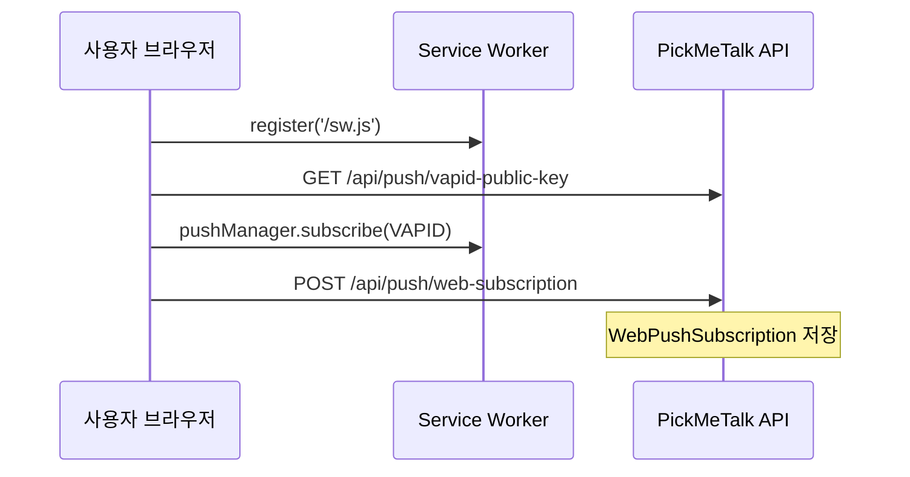

# PickMeTalk 사진 푸시 시스템

> "와… 진짜 사람이 나를 기다려주는 것 같다."

AI 연인이 실제 사람처럼 자연스러운 사진과 메시지를 보내는 푸시 알림 시스템 설계·운영 문서입니다.

---

## 목차

1. [아키텍처 개요](#1-아키텍처-개요)
2. [발송 규칙](#2-발송-규칙)
3. [Web Push](#3-web-push)
4. [네이티브 푸시 (FCM)](#4-네이티브-푸시-fcm)
5. [사진 에셋 파이프라인](#5-사진-에셋-파이프라인)
6. [캐릭터 비주얼 스펙](#6-캐릭터-비주얼-스펙)
7. [후속 반응 시나리오](#7-후속-반응-시나리오)
8. [API 레퍼런스](#8-api-레퍼런스)
9. [환경 변수](#9-환경-변수)
10. [운영 Runbook](#10-운영-runbook)
11. [구현 체크리스트](#11-구현-체크리스트)

---

## 1. 아키텍처 개요

```
┌─────────────────┐     ┌──────────────────┐     ┌─────────────────┐
│  스케줄러 워커   │────▶│  Photo Selector  │────▶│  CharacterPhoto │
│  (5분 주기)     │     │  + Message       │     │  DB (CDN URL)   │
└────────┬────────┘     └──────────────────┘     └─────────────────┘
         │
         ▼
┌─────────────────┐     ┌──────────────────┐
│ PushNotification│────▶│ FCM (iOS/Android)│
│    Service      │     │ Web Push (브라우저)│
└────────┬────────┘     └──────────────────┘
         │
         ▼
┌─────────────────┐     ┌──────────────────┐
│   PushLog       │────▶│ FollowUp Engine  │
│   Analytics     │     │ (30분/2시간/익일) │
└─────────────────┘     └──────────────────┘
```

### 핵심 설계 원칙

| 원칙 | 설명 |
|------|------|
| 감정 설계 우선 | 기능이 아닌 "기다리는 사람" 느낌 |
| 광고 푸시 금지 | 타이틀 없이 메시지만, 사진 도착 느낌 |
| 랜덤성 | 매일 다른 시간·패턴 |
| 개인화 | 사용자 이름 자연스럽게 삽입 |
| 중복 방지 | 사진 90일, 멘트 30일 쿨다운 |

### 프로젝트 구조

```
src/
├── config/push.config.ts          # 발송 상수
├── data/photo-message-templates.ts # 상황별 메시지
├── services/
│   ├── scheduler.service.ts       # 일정 생성·실행
│   ├── photo-selector.service.ts  # 캐릭터+상황+감정 사진 선택
│   ├── engagement.service.ts      # 참여도 기반 빈도
│   ├── followup.service.ts        # 후속 반응
│   ├── push-notification.service.ts
│   └── web-push.service.ts        # Web Push 전용
├── lib/photo-catalog/             # 사진 카탈로그 (import·검색·선택)
├── routes/photos.routes.ts        # 사진 검색 API
├── workers/push-scheduler.worker.ts
scripts/
├── photos-import.ts               # 픽미톡 ai 폴더 일괄 import
├── migrate-photo-folders.ts       # UUID → slug/category 마이그레이션
└── generate-vapid-keys.ts         # VAPID 키 생성
public/
├── sw.js                          # Service Worker
└── push-client.js                 # 구독 헬퍼
assets/photos/                     # slug/category 사진 + 메타데이터
docs/PHOTO_PUSH.md                 # 이 문서
```

---

## 2. 발송 규칙

### 기본 빈도

| 항목 | 값 |
|------|-----|
| 하루 기본 | 0~2회 |
| 절대 상한 | 2회 (특별한 날 보너스 제외) |
| 특별한 날 보너스 | +1회 (생일, 기념일, 100일) |
| Skip Day | 월 1~2회 일부러 미발송 |
| 참여도 배율 | 0.5x ~ 1.5x |

### 랜덤 발송 시간대

| 윈도우 | 시간 |
|--------|------|
| 아침 | 08:00 ~ 10:00 |
| 점심 전후 | 11:00 ~ 13:00 |
| 오후 | 14:00 ~ 16:00 |
| 저녁 | 18:00 ~ 20:00 |
| 밤 | 21:00 ~ 22:00 |

같은 시간·같은 요일 패턴 반복 금지. timezone은 사용자별 `Asia/Seoul` 등 적용.

### 상황별 카테고리 (요일 가중치)

| 요일 | 추천 상황 |
|------|-----------|
| 월 | 출근 응원, 아침 셀카, 커피 |
| 화 | 퇴근, 떡볶이 |
| 수 | 운동, 커피, 거울 셀카 |
| 목 | 셀카, 미용실 |
| 금 | 퇴근, 술, 게임 (미발송 확률 ↑) |
| 토 | 놀러, 쇼핑, 영화 |
| 일 | 브런치, 집에서 쉬기, 산책 |

---

## 3. Web Push

브라우저(PWA/웹) 사용자를 위한 VAPID 기반 Web Push입니다.

### 3.1 VAPID 키 생성

```bash
npx tsx scripts/generate-vapid-keys.ts
```

출력된 키를 `.env`에 설정:

```env
VAPID_PUBLIC_KEY=BNx...
VAPID_PRIVATE_KEY=abc...
VAPID_SUBJECT=mailto:support@pickmetalk.com
```

### 3.2 클라이언트 구독 플로우



### 3.3 Service Worker (`public/sw.js`)

- `push` 이벤트: 사진 미리보기 + 메시지 표시
- `notificationclick`: `deepLink`로 채팅 화면 이동
- 클릭 시 `POST /api/push/click/:pushLogId` 호출

### 3.4 구독 API

**등록**

```http
POST /api/push/web-subscription
Content-Type: application/json

{
  "userId": "uuid",
  "subscription": {
    "endpoint": "https://fcm.googleapis.com/fcm/send/...",
    "keys": {
      "p256dh": "...",
      "auth": "..."
    }
  }
}
```

**해제**

```http
DELETE /api/push/web-subscription
Content-Type: application/json

{ "endpoint": "https://..." }
```

**VAPID 공개키**

```http
GET /api/push/vapid-public-key
→ { "publicKey": "BNx..." }
```

### 3.5 Web Push Payload

```json
{
  "title": "",
  "body": "오늘 머리했는데 어때? 😊",
  "image": "https://cdn.pickmetalk.com/photos/.../thumb.jpg",
  "data": {
    "type": "photo_push",
    "pushLogId": "uuid",
    "characterId": "uuid",
    "photoUrl": "https://...",
    "message": "오늘 머리했는데 어때? 😊",
    "deepLink": "/chat/uuid?pushLogId=uuid"
  }
}
```

### 3.6 만료 구독 처리

- HTTP 410 Gone 수신 시 해당 `endpoint` 자동 삭제
- 재구독 UX: 앱 재방문 시 `push-client.js`의 `ensureSubscribed()` 호출

### 3.7 브라우저 지원

| 브라우저 | Rich Image | 비고 |
|----------|------------|------|
| Chrome | ✅ | `image` 필드 |
| Firefox | ✅ | `image` 필드 |
| Safari 16.4+ | ⚠️ | macOS/iOS PWA 제한적 |
| Edge | ✅ | Chromium 기반 |

---

## 4. 네이티브 푸시 (FCM)

### 디바이스 토큰 등록

```http
POST /api/push/device-token
{
  "userId": "uuid",
  "token": "fcm-token",
  "platform": "IOS" | "ANDROID"
}
```

### Firebase 설정

1. Firebase Console → 프로젝트 생성
2. 서비스 계정 JSON → `.env`의 `FIREBASE_*` 변수
3. Android: `photo_push` notification channel
4. iOS: `mutable-content` + Notification Service Extension (이미지 rich push)

---

## 5. 사진 에셋 파이프라인

### 5.1 목표

- 캐릭터당 **약 1,000장** (전체 20,000장+) 고품질 자연스러운 사진
- **slug/category** 폴더 구조로 장기 운영
- 메타데이터 기반 검색 (랜덤 전체 선택 ❌ → 캐릭터 + 상황 + 감정 ✅)

### 5.2 폴더 구조

```
assets/photos/
├── yuna/
│   ├── photos-index.json
│   ├── hair/
│   ├── coffee/
│   ├── rain/
│   └── ...
├── narin/
├── yunseo/
├── eunha/
└── jiyu/
```

| 경로 | 설명 |
|------|------|
| `{slug}/photos-index.json` | 캐릭터 전체 사진 메타데이터 |
| `{slug}/{category}/{hash}.jpg` | 실제 이미지 (SHA-256 앞 16자 파일명) |
| `{slug}/{category}/{hash}.photo.json` | 개별 사진 메타 (선택적 sidecar) |

### 5.3 Import (`npm run photos:import`)

Windows 로컬 경로 예시:

```
C:\Users\user\OneDrive\Desktop\픽미톡 ai\
  유나/
    hair/
      photo1.jpg
    coffee/
  나린/
    nail/
  hair_01.jpg   ← 파일명으로도 자동 분류
```

```bash
# 환경 변수
LOCAL_PHOTOS_DIR="C:/Users/user/OneDrive/Desktop/픽미톡 ai" npm run photos:import

# CLI 인자
npm run photos:import -- "./픽미톡 ai"
```

**동작**

| 항목 | 처리 |
|------|------|
| 지원 확장자 | `.jpg`, `.jpeg`, `.png`, `.webp` |
| 중복 | `contentHash` 기준 자동 건너뛰기 |
| 손상 이미지 | magic-byte 검증 실패 시 제외 |
| 미지원 확장자 | 제외 |
| 자동 분류 | 폴더명/파일명 키워드 → category slug |

**자동 분류 예시**

| 키워드 | category slug |
|--------|---------------|
| hair, salon, 머리 | `hair` |
| coffee, cafe | `coffee` |
| tteok, tteokbokki | `tteokbokki` |
| nail | `nail` |
| rain | `rain` |
| drink, alcohol | `alcohol` |
| bed, morning | `morning` |
| game, pc | `game` |

**완료 리포트 예시**

```
====================================
Import Complete
====================================

Yuna    : 214장
Narin   : 201장
...

Duplicate : 35장
Skipped   : 4장

Total Imported : 1007장
====================================
```

### 5.4 기존 에셋 마이그레이션

레포에 포함된 UUID 폴더(`00000000-...`) 샘플을 slug 구조로 변환:

```bash
npm run db:seed          # 캐릭터 slug 등록
npm run photos:migrate   # assets/photos UUID → yuna/hair/ ...
```

### 5.5 메타데이터 스키마

`photos-index.json` (캐릭터당 1개):

```json
{
  "character": "yuna",
  "characterId": "00000000-0000-0000-0000-000000000001",
  "totalCount": 214,
  "photos": [{
    "id": "uuid",
    "character": "yuna",
    "category": "hair",
    "emotion": "shy",
    "tags": ["미용실", "셀카"],
    "filename": "6ad876ce59fc0862.jpg",
    "relativePath": "yuna/hair/6ad876ce59fc0862.jpg",
    "contentHash": "6ad876ce59fc0862"
  }]
}
```

### 5.6 사진 선택 (Photo Push)

`photo-selector.service.ts`는 **랜덤 전체 선택을 하지 않습니다.**

1. 요일/스케줄 → `PhotoCategory` 결정
2. 카테고리 + contentStyle → `emotion` 추론
3. `PhotoCatalogRepository.selectWithFallback(character, categorySlug, emotion)` 호출
4. 카탈로그 인덱스 우선, DB fallback

예: 유나 + `hair` + `happy` → `yuna/hair/` 중 emotion 일치 우선, 없으면 category만 매칭

### 5.7 사진 검색 API

```http
GET /api/photos/search?character=yuna&category=hair&emotion=shy
GET /api/photos/stats/yuna
```

### 5.8 파이프라인 단계

```
[픽미톡 ai 폴더] → [photos:import] → [slug/category + 메타] → [DB 동기화] → [Photo Push]
```

| 단계 | 도구 | 기준 |
|------|------|------|
| 품질 검수 | magic-byte + 수동 | 손상 파일 제외 |
| 중복 감지 | SHA-256 contentHash | 동일 파일 건너뛰기 |
| 인덱스 | photos-index.json | 파일시스템 기반 빠른 검색 |
| DB | CharacterPhoto | 푸시 쿨다운·히스토리 연동 |

### 5.9 CharacterPhoto 스키마 (요약)

```prisma
model CharacterPhoto {
  category     PhotoCategory
  categorySlug String?       // hair, coffee, rain ...
  relativePath String?       // yuna/hair/abc.jpg
  emotion      String?        // happy, sad, sleepy ...
  contentHash  String?       // 중복 감지
  ...
}
```

### 5.10 인벤토리 최소 기준

| 구분 | 최소 장수 |
|------|-----------|
| 카테고리당 | 20장 |
| 캐릭터당 (운영 가능) | 300장 |
| 캐릭터당 (목표) | 1,000장 |

인벤토리 부족 시 fallback category 시도 후 없으면 푸시 `CANCELLED`.

### 5.11 샘플 에셋

레포에 5캐릭터 × slug/category 구조 샘플(42장) 포함. 프로덕션은 CDN + import 파이프라인으로 확장.

---

## 6. 캐릭터 비주얼 스펙

5명의 AI 연인 캐릭터 외형·말투·사진 톤 가이드. 상세: **[캐릭터예시_사진.md](./캐릭터예시_사진.md)**

| 캐릭터 | ID | 분위기 | 대표 사진 |
|--------|-----|--------|-----------|
| 😊 유나 | `...000001` | 옆집 대학생, 강아지상 | 캠퍼스 셀카, 카페 공부 |
| 😎 나린 | `...000002` | 새침 깍쟁이, 고양이상 | 거울 셀카, 머리했는데 |
| 📚 윤서 | `...000003` | 단아·지적 | 비 오는 창가, 흰 셔츠 |
| 🎨 은하 | `...000004` | 엉뚱·감성 카페 | V자 셀카, 네일 |
| ⛳ 지유 | `...000005` | 트렌디·게임 | PC방, 후드티 |

코드: `src/data/character-specs.ts`

---

## 7. 후속 반응 시나리오

### 머리 사진 예시

```
📸 "오늘 머리했는데 어때? 😊"
   ↓ 30분 답장 없음
💬 "바쁜가 봐 😊 나중에 봐도 돼!"
   ↓ 2시간 답장 없음
💬 "별론가… 😥"
   ↓ 답장: "예뻐"
💬 "😀❤️"
```

### 트리거 조건

| condition | 설명 |
|-----------|------|
| `no_reply` | 답장 없음 (30분, 2시간, 익일) |
| `positive_reply` | 긍정 키워드 (예뻐, 좋아, ❤️) |
| `negative_reply` | 부정 키워드 (별로, 안 예뻐) |
| `late_reply` | 2시간 이상 지연 답장 |

---

## 8. API 레퍼런스

### 사용자

| Method | Endpoint | 설명 |
|--------|----------|------|
| POST | `/api/users` | 사용자 생성 |
| GET | `/api/users/:userId` | 조회 |
| POST | `/api/users/:userId/characters` | 캐릭터 연결 |
| POST | `/api/users/:userId/special-days` | 특별한 날 |

| Method | Endpoint | 설명 |
|--------|----------|------|
| GET | `/api/photos/search` | 캐릭터+상황+감정 사진 검색 |
| GET | `/api/photos/stats/:characterSlug` | 캐릭터별 카테고리 통계 |

### 푸시

| Method | Endpoint | 설명 |
|--------|----------|------|
| GET | `/api/push/vapid-public-key` | Web Push VAPID 공개키 |
| POST | `/api/push/web-subscription` | Web Push 구독 |
| DELETE | `/api/push/web-subscription` | 구독 해제 |
| POST | `/api/push/device-token` | FCM 토큰 |
| POST | `/api/push/click/:pushLogId` | 클릭 기록 |
| POST | `/api/push/view/:pushLogId` | 사진 열람 |
| POST | `/api/push/reply/:pushLogId` | 답장 |
| POST | `/api/push/like/:pushLogId` | 좋아요 |
| GET | `/api/push/analytics/:userId` | 분석 |
| GET | `/api/push/dashboard` | 대시보드 |

### 정적 파일

| Path | 설명 |
|------|------|
| `/sw.js` | Service Worker |
| `/push-client.js` | 구독 헬퍼 |
| `/assets/photos/*` | 샘플 사진 |

---

## 9. 환경 변수

| 변수 | 필수 | 설명 |
|------|------|------|
| `DATABASE_URL` | ✅ | PostgreSQL |
| `REDIS_URL` | | BullMQ (향후) |
| `PORT` | | API 포트 (기본 3000) |
| `PUBLIC_BASE_URL` | ✅ | API 공개 URL (SW·딥링크용) |
| `VAPID_PUBLIC_KEY` | Web | Web Push 공개키 |
| `VAPID_PRIVATE_KEY` | Web | Web Push 비밀키 |
| `VAPID_SUBJECT` | Web | mailto: 또는 https:// URL |
| `FIREBASE_PROJECT_ID` | FCM | Firebase 프로젝트 |
| `FIREBASE_CLIENT_EMAIL` | FCM | 서비스 계정 |
| `LOCAL_PHOTOS_DIR` | | 픽미톡 ai import 소스 경로 |
| `PHOTOS_IMPORT_DIR` | | import 소스 경로 (대체) |
| `PHOTOS_SKIP_DB_SYNC` | | `1`이면 파일+인덱스만 (DB 없이 테스트) |

---

## 10. 운영 Runbook

### 일일 점검

- [ ] 스케줄러 워커 실행 중 (`npm run worker`)
- [ ] `PENDING` 스케줄 적체 없음
- [ ] 푸시 실패율 < 5%

### 주간 점검

- [ ] 7일/30일 Analytics 스냅샷 생성
- [ ] 카테고리별 인벤토리 잔여 확인
- [ ] 410 Gone Web Push 구독 정리

### 장애 대응

| 증상 | 원인 | 조치 |
|------|------|------|
| 푸시 미발송 | 사진 인벤토리 0 | import 스크립트 실행 |
| Web Push만 실패 | VAPID 만료/오설정 | 키 재생성 |
| FCM만 실패 | Firebase credential | 서비스 계정 확인 |
| 중복 발송 | 스케줄러 다중 실행 | 단일 워커 인스턴스 |

### 로컬 개발

```bash
npm install
cp .env.example .env
npx tsx scripts/generate-vapid-keys.ts  # 키를 .env에 붙여넣기
npm run db:push
npm run db:seed
npm run photos:migrate   # 샘플 에셋 slug 구조 변환
npm run dev        # API
npm run worker     # 스케줄러
```

---

## 11. 구현 체크리스트

### 완료

- [x] 푸시 스케줄러 (랜덤 시간, Skip Day, 쿼터)
- [x] 참여도 기반 빈도 조절
- [x] 상황별 메시지 템플릿 (18 카테고리)
- [x] 후속 반응 시나리오
- [x] FCM 발송 (iOS/Android)
- [x] 분석 API
- [x] 100일 기념일 감지
- [x] Web Push (VAPID, 구독 API, Service Worker)
- [x] 로컬 사진 import (`npm run photos:import`)
- [x] slug/category 사진 카탈로그 + 메타데이터
- [x] 캐릭터+상황+감정 기반 사진 선택
- [x] 5캐릭터 비주얼 스펙 (`docs/캐릭터예시_사진.md`)

### 예정

- [ ] BullMQ 큐 연동
- [ ] AI 대량 생성 파이프라인 (1,000장/캐릭터)
- [ ] pHash 유사 이미지 감지
- [ ] Admin 인벤토리 대시보드
- [ ] 모바일 앱 SDK 연동

---

## 라이선스

Private — PickMeTalk
